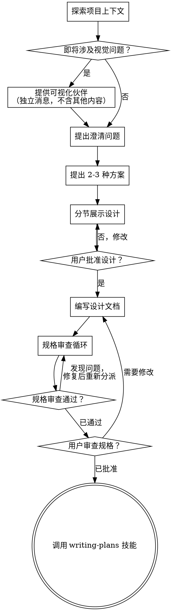

# 头脑风暴：将想法转化为设计

帮助通过自然的协作对话将想法转化为完整的设计和规格说明。

首先了解当前项目上下文，然后逐一提问以完善想法。一旦理解了要构建的内容，就展示设计方案并获取用户批准。

<HARD-GATE>
在展示设计方案并获得用户批准之前，不要调用任何实现技能、编写任何代码、搭建任何项目或采取任何实现行动。无论项目看起来多么简单，都适用此规则。
</HARD-GATE>

## 反模式："这太简单了，不需要设计"

每个项目都要经过这个流程。待办列表、单函数工具、配置变更——全都如此。"简单"的项目恰恰是未经审视的假设造成最多浪费的地方。设计可以很简短（对于真正简单的项目只需几句话），但你必须展示它并获得批准。

## 检查清单

你必须为以下每项创建任务，并按顺序完成：

1. **探索项目上下文** — 检查文件、文档、近期提交
2. **提供可视化伙伴**（如果主题涉及视觉问题）— 这是独立的一条消息，不与澄清问题合并。参见下方"可视化伙伴"章节。
3. **提出澄清问题** — 每次一个问题，理解目的/约束/成功标准
4. **提出 2-3 种方案** — 包含权衡分析和你的推荐
5. **展示设计** — 按复杂度分节展示，每节后获取用户批准
6. **编写设计文档** — 保存到 `docs/superpowers/specs/YYYY-MM-DD-<topic>-design.md` 并提交
7. **规格审查循环** — 分派 spec-document-reviewer 子代理，使用精心构建的审查上下文（而非你的会话历史）；修复问题并重新分派直至通过（最多 3 次迭代，之后交由人工处理）
8. **用户审查书面规格** — 在继续之前请用户审查规格文件
9. **过渡到实现** — 调用 writing-plans 技能创建实现计划

## 流程图

**终止状态是调用 writing-plans。** 不要调用 frontend-design、mcp-builder 或任何其他实现技能。头脑风暴之后唯一调用的技能是 writing-plans。

## 流程详解

**理解想法：**

- 首先检查当前项目状态（文件、文档、近期提交）
- 在提出详细问题之前，先评估范围：如果请求描述了多个独立的子系统（例如"构建一个包含聊天、文件存储、计费和分析功能的平台"），立即标记这一点。不要花时间去完善一个需要先分解的项目的细节。
- 如果项目太大，无法用一份规格说明覆盖，帮助用户分解为子项目：哪些是独立的部分、它们之间如何关联、应该按什么顺序构建？然后按照正常的设计流程对第一个子项目进行头脑风暴。每个子项目有自己的规格 → 计划 → 实现循环。
- 对于范围适当的项目，逐一提问以完善想法
- 尽可能使用选择题，开放式问题也可以
- 每条消息只问一个问题——如果一个主题需要更多探讨，拆分成多个问题
- 重点理解：目的、约束、成功标准

**探索方案：**

- 提出 2-3 种不同的方案及其权衡
- 以对话方式展示选项，给出你的推荐和理由
- 首先介绍你推荐的选项并解释原因

**展示设计：**

- 一旦你认为理解了要构建的内容，就展示设计
- 每一节按复杂度缩放：简单的几句话，复杂的可以到 200-300 字
- 每节结束后询问到目前为止是否正确
- 涵盖：架构、组件、数据流、错误处理、测试
- 准备好在某些内容不明确时回头澄清

**为隔离性和清晰性而设计：**

- 将系统拆分为更小的单元，每个单元只有一个清晰的目的，通过定义良好的接口通信，可以独立理解和测试
- 对于每个单元，你应该能回答：它做什么、如何使用它、它依赖什么？
- 不看内部实现，别人能理解一个单元做什么吗？能在不破坏消费者的情况下修改内部实现吗？如果不能，边界需要改进。
- 更小、边界清晰的单元也更便于你工作——你能更好地推理可以在上下文中完整容纳的代码，当文件聚焦时你的编辑也更可靠。当文件变得很大时，这通常意味着它做了太多事情。

**在现有代码库中工作：**

- 在提出修改建议之前先探索现有结构。遵循现有模式。
- 当现有代码存在影响当前工作的问题时（例如文件变得太大、边界不清晰、职责纠缠），将有针对性的改进作为设计的一部分——就像一个好的开发者在工作中改善所接触的代码一样。
- 不要提议无关的重构。专注于服务当前目标的事情。

## 设计完成后

**文档编写：**

- 将经过验证的设计（规格说明）写入 `docs/superpowers/specs/YYYY-MM-DD-<topic>-design.md`
  - （用户对规格文件位置的偏好优先于此默认值）
- 如果可用，使用 elements-of-style:writing-clearly-and-concisely 技能
- 将设计文档提交到 git

**规格审查循环：**
编写规格文档后：

1. 分派 spec-document-reviewer 子代理（参见 spec-document-reviewer-prompt.md）
2. 如果发现问题：修复、重新分派，重复直至通过
3. 如果循环超过 3 次迭代，交由人工指导

**用户审查关卡：**
规格审查循环通过后，请用户在继续之前审查书面规格：

> "规格已编写并提交到 `<path>`。请审查并告诉我在开始编写实现计划之前是否需要任何修改。"

等待用户回复。如果他们要求修改，进行修改并重新运行规格审查循环。只有在用户批准后才继续。

**实现：**

- 调用 writing-plans 技能创建详细的实现计划
- 不要调用任何其他技能。writing-plans 是下一步。

## 核心原则

- **每次只问一个问题** — 不要用多个问题让用户不知所措
- **优先使用选择题** — 在可能的情况下比开放式问题更容易回答
- **严格遵循 YAGNI** — 从所有设计中移除不必要的功能
- **探索替代方案** — 在做决定之前始终提出 2-3 种方案
- **增量验证** — 展示设计，获得批准后再继续
- **保持灵活** — 当某些内容不明确时回头澄清

## 可视化伙伴

一个基于浏览器的工具，用于在头脑风暴期间展示模型图、图表和视觉选项。它是一个工具——不是一种模式。接受伙伴意味着它可用于需要视觉呈现的问题；这并不意味着每个问题都通过浏览器展示。

**提供伙伴：** 当你预计即将到来的问题涉及视觉内容（模型图、布局、图表）时，征求一次同意：
> "我们接下来要讨论的一些内容如果能在浏览器中展示会更容易理解。我可以在讨论过程中制作模型图、图表、对比和其他可视化内容。这个功能还比较新，可能会消耗较多 token。要试试吗？（需要打开一个本地 URL）"

**这个提议必须是独立的一条消息。** 不要与澄清问题、上下文摘要或任何其他内容合并。消息应该只包含上面的提议，不含其他内容。等待用户回复后再继续。如果他们拒绝，继续纯文本方式的头脑风暴。

**逐问题决策：** 即使用户同意后，也要对每个问题分别决定使用浏览器还是终端。判断标准：**用户看到它比读到它更容易理解吗？**

- **使用浏览器**展示本身就是视觉性的内容 — 模型图、线框图、布局对比、架构图、并排视觉设计
- **使用终端**展示文本性的内容 — 需求问题、概念选择、权衡列表、A/B/C/D 文本选项、范围决策

关于 UI 主题的问题不自动成为视觉问题。"在这个上下文中'个性化'是什么意思？"是概念性问题——使用终端。"哪种向导布局更好？"是视觉问题——使用浏览器。

如果他们同意使用伙伴，在继续之前阅读详细指南：
`skills/brainstorming/visual-companion.md`
