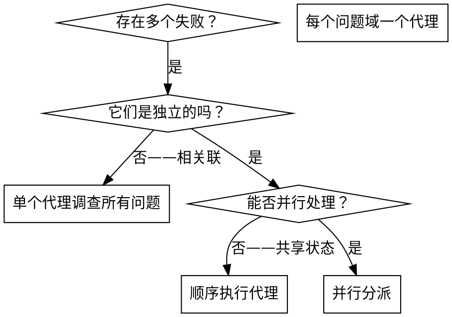

# 分派并行代理

## 概述

你将任务委派给拥有隔离上下文的专用代理。通过精心构建它们的指令和上下文，确保它们专注于各自的任务并成功完成。它们不应继承你的会话上下文或历史——你精确构建它们所需的一切。这也有助于保留你自己的上下文用于协调工作。

当你遇到多个不相关的失败（不同的测试文件、不同的子系统、不同的 bug）时，逐一调查会浪费时间。每个调查都是独立的，可以并行进行。

**核心原则：** 每个独立的问题域分派一个代理，让它们并发工作。

## 何时使用



**适用场景：**
- 3 个以上测试文件因不同根因而失败
- 多个子系统独立地出现故障
- 每个问题可以在不需要其他问题上下文的情况下理解
- 调查之间没有共享状态

**不适用场景：**
- 失败是相关联的（修复一个可能修复其他的）
- 需要理解完整的系统状态
- 代理之间会相互干扰

## 使用模式

### 1. 识别独立域

按故障类型分组：
- 文件 A 测试：工具审批流程
- 文件 B 测试：批量完成行为
- 文件 C 测试：中止功能

每个域是独立的——修复工具审批不会影响中止测试。

### 2. 创建聚焦的代理任务

每个代理获得：
- **具体范围：** 一个测试文件或子系统
- **明确目标：** 让这些测试通过
- **约束条件：** 不要修改其他代码
- **预期输出：** 发现和修复内容的摘要

### 3. 并行分派

```typescript
// 在 Claude Code / AI 环境中
Task("修复 agent-tool-abort.test.ts 的失败")
Task("修复 batch-completion-behavior.test.ts 的失败")
Task("修复 tool-approval-race-conditions.test.ts 的失败")
// 三个任务同时运行
```

### 4. 审查和集成

当代理返回时：
- 阅读每个摘要
- 验证修复之间没有冲突
- 运行完整的测试套件
- 集成所有修改

## 代理提示词结构

好的代理提示词应该：
1. **聚焦** - 一个清晰的问题域
2. **自包含** - 包含理解问题所需的所有上下文
3. **明确输出要求** - 代理应该返回什么？

```markdown
修复 src/agents/agent-tool-abort.test.ts 中的 3 个失败测试：

1. "should abort tool with partial output capture" - 期望消息中包含 'interrupted at'
2. "should handle mixed completed and aborted tools" - 快速工具被中止而非完成
3. "should properly track pendingToolCount" - 期望 3 个结果但得到 0

这些是时序/竞态条件问题。你的任务：

1. 阅读测试文件，理解每个测试验证的内容
2. 找出根本原因——是时序问题还是实际 bug？
3. 修复方法：
   - 用基于事件的等待替换固定超时
   - 如果发现中止实现中的 bug 则修复
   - 如果测试的行为已改变则调整测试预期

不要仅仅增加超时——找到真正的问题。

返回：发现内容和修复内容的摘要。
```

## 常见错误

**错误：范围太广：** "修复所有测试" - 代理会迷失方向
**正确：具体明确：** "修复 agent-tool-abort.test.ts" - 范围聚焦

**错误：没有上下文：** "修复竞态条件" - 代理不知道在哪里
**正确：提供上下文：** 粘贴错误信息和测试名称

**错误：没有约束：** 代理可能重构所有代码
**正确：设定约束：** "不要修改生产代码"或"只修复测试"

**错误：输出要求模糊：** "修复它" - 你不知道改了什么
**正确：明确要求：** "返回根本原因和修改内容的摘要"

## 何时不使用

**相关联的失败：** 修复一个可能修复其他的——先一起调查
**需要完整上下文：** 理解问题需要看到整个系统
**探索性调试：** 你还不知道什么坏了
**共享状态：** 代理会相互干扰（编辑相同文件、使用相同资源）

## 来自实际会话的示例

**场景：** 重大重构后 3 个文件出现 6 个测试失败

**失败详情：**
- agent-tool-abort.test.ts：3 个失败（时序问题）
- batch-completion-behavior.test.ts：2 个失败（工具未执行）
- tool-approval-race-conditions.test.ts：1 个失败（执行次数 = 0）

**决策：** 独立的域——中止逻辑与批量完成与竞态条件相互独立

**分派：**
```
代理 1 → 修复 agent-tool-abort.test.ts
代理 2 → 修复 batch-completion-behavior.test.ts
代理 3 → 修复 tool-approval-race-conditions.test.ts
```

**结果：**
- 代理 1：用基于事件的等待替换了超时
- 代理 2：修复了事件结构 bug（threadId 位置错误）
- 代理 3：添加了对异步工具执行完成的等待

**集成：** 所有修复相互独立，无冲突，完整测试套件全部通过

**节省时间：** 3 个问题并行解决 vs 顺序解决

## 核心优势

1. **并行化** — 多个调查同时进行
2. **聚焦** — 每个代理范围窄，需要跟踪的上下文少
3. **独立性** — 代理之间不会相互干扰
4. **速度** — 用解决 1 个问题的时间解决 3 个问题

## 验证

代理返回后：
1. **审查每个摘要** — 了解改了什么
2. **检查冲突** — 代理是否编辑了相同的代码？
3. **运行完整套件** — 验证所有修复一起工作
4. **抽查** — 代理可能犯系统性错误

## 实际效果

来自调试会话（2025-10-03）：
- 3 个文件中的 6 个失败
- 并行分派了 3 个代理
- 所有调查同时完成
- 所有修复成功集成
- 代理修改之间零冲突
