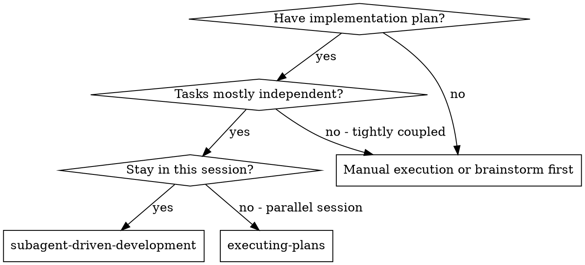
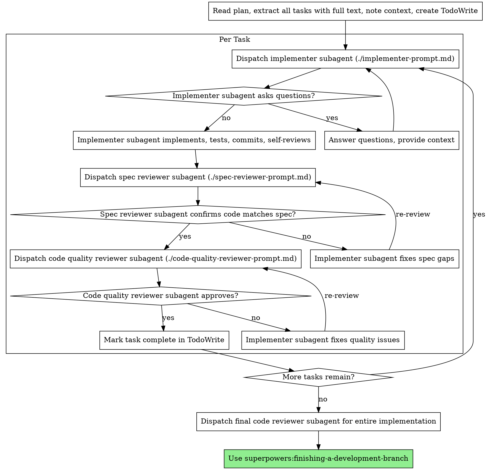

# 子代理驱动开发

通过为每个任务派遣新的子代理（subagent）来执行计划，每个任务完成后进行两阶段审查：先审查规格合规性，再审查代码质量。

**为什么使用子代理：** 你将任务委派给具有隔离上下文的专门代理。通过精心构造它们的指令和上下文，确保它们专注于任务并成功完成。它们不应继承你的会话上下文或历史——你需要精确构造它们所需的内容。这同时也为你的协调工作保留了自身的上下文。

**核心原则：** 每个任务一个新子代理 + 两阶段审查（规格 + 质量）= 高质量、快速迭代

## 何时使用



**与执行计划（并行会话）的对比：**
- 同一会话（无上下文切换）
- 每个任务使用新子代理（无上下文污染）
- 每个任务后进行两阶段审查：先规格合规性，再代码质量
- 更快的迭代（任务间无需人工介入）

## 流程



## 模型选择

使用能胜任各角色的最低能力模型，以节省成本并提高速度。

**机械性实现任务**（独立函数、明确规格、1-2 个文件）：使用快速、低成本的模型。当计划规格明确时，大多数实现任务都是机械性的。

**集成和判断性任务**（多文件协调、模式匹配、调试）：使用标准模型。

**架构、设计和审查任务**：使用最强的可用模型。

**任务复杂度信号：**
- 涉及 1-2 个文件且有完整规格 → 低成本模型
- 涉及多个文件且有集成关注点 → 标准模型
- 需要设计判断或广泛的代码库理解 → 最强模型

## 处理实现者状态

实现者子代理会报告四种状态之一。按以下方式处理：

**DONE：** 进入规格合规性审查。

**DONE_WITH_CONCERNS：** 实现者完成了工作但标记了疑虑。在继续之前阅读这些疑虑。如果疑虑涉及正确性或范围，在审查前解决它们。如果只是观察性意见（例如"这个文件越来越大了"），记录下来并继续进入审查。

**NEEDS_CONTEXT：** 实现者需要未提供的信息。提供缺失的上下文并重新派遣。

**BLOCKED：** 实现者无法完成任务。评估阻塞原因：
1. 如果是上下文问题，提供更多上下文并使用相同模型重新派遣
2. 如果任务需要更强的推理能力，使用更强的模型重新派遣
3. 如果任务太大，将其拆分为更小的部分
4. 如果计划本身有误，向人类上报

**绝不**忽视上报或在不做任何改变的情况下强制同一模型重试。如果实现者说它卡住了，说明有些东西需要改变。

## 提示模板

- `./implementer-prompt.md` - 派遣实现者子代理
- `./spec-reviewer-prompt.md` - 派遣规格合规性审查者子代理
- `./code-quality-reviewer-prompt.md` - 派遣代码质量审查者子代理

## 工作流示例

```
你：我正在使用子代理驱动开发来执行这个计划。

[读取计划文件一次：docs/superpowers/plans/feature-plan.md]
[提取所有 5 个任务的完整文本和上下文]
[使用 TodoWrite 创建所有任务]

任务 1：Hook 安装脚本

[获取任务 1 的文本和上下文（已提取）]
[使用完整任务文本 + 上下文派遣实现子代理]

实现者："在我开始之前——hook 应该安装在用户级别还是系统级别？"

你："用户级别（~/.config/superpowers/hooks/）"

实现者："明白了。现在开始实现..."
[稍后] 实现者：
  - 实现了 install-hook 命令
  - 添加了测试，5/5 通过
  - 自查：发现我遗漏了 --force 标志，已添加
  - 已提交

[派遣规格合规性审查者]
规格审查者：✅ 符合规格——满足所有需求，没有多余内容

[获取 git SHA，派遣代码质量审查者]
代码审查者：优点：测试覆盖良好，代码整洁。问题：无。通过。

[标记任务 1 完成]

任务 2：恢复模式

[获取任务 2 的文本和上下文（已提取）]
[使用完整任务文本 + 上下文派遣实现子代理]

实现者：[没有问题，直接开始]
实现者：
  - 添加了验证/修复模式
  - 8/8 测试通过
  - 自查：一切正常
  - 已提交

[派遣规格合规性审查者]
规格审查者：❌ 问题：
  - 缺失：进度报告（规格要求"每 100 项报告一次"）
  - 多余：添加了 --json 标志（未被要求）

[实现者修复问题]
实现者：移除了 --json 标志，添加了进度报告

[规格审查者再次审查]
规格审查者：✅ 现在符合规格

[派遣代码质量审查者]
代码审查者：优点：扎实。问题（重要）：魔术数字（100）

[实现者修复]
实现者：提取了 PROGRESS_INTERVAL 常量

[代码审查者再次审查]
代码审查者：✅ 通过

[标记任务 2 完成]

...

[所有任务完成后]
[派遣最终代码审查者]
最终审查者：所有需求已满足，可以合并

完成！
```

## 优势

**对比手动执行：**
- 子代理自然遵循 TDD
- 每个任务有新的上下文（不会混淆）
- 并行安全（子代理不会互相干扰）
- 子代理可以提问（工作前和工作中都可以）

**对比执行计划：**
- 同一会话（无交接）
- 持续推进（无需等待）
- 审查检查点自动化

**效率提升：**
- 无文件读取开销（控制者提供完整文本）
- 控制者精确策划所需上下文
- 子代理预先获得完整信息
- 问题在工作开始前就被提出（而非之后）

**质量关卡：**
- 自查在交接前发现问题
- 两阶段审查：规格合规性，然后是代码质量
- 审查循环确保修复确实有效
- 规格合规性防止过度/不足构建
- 代码质量确保实现质量良好

**成本：**
- 更多子代理调用（每个任务需要实现者 + 2 个审查者）
- 控制者需要更多准备工作（预先提取所有任务）
- 审查循环增加迭代次数
- 但能及早发现问题（比后期调试成本更低）

## 危险信号

**绝不要：**
- 未经用户明确同意就在 main/master 分支上开始实现
- 跳过审查（规格合规性或代码质量）
- 在未修复的问题存在时继续
- 并行派遣多个实现子代理（会产生冲突）
- 让子代理自己读取计划文件（应提供完整文本）
- 跳过场景设定上下文（子代理需要理解任务所处的位置）
- 忽视子代理的问题（在让它们继续之前先回答）
- 在规格合规性上接受"差不多就行"（规格审查者发现问题 = 未完成）
- 跳过审查循环（审查者发现问题 = 实现者修复 = 再次审查）
- 让实现者的自查替代正式审查（两者都需要）
- **在规格合规性通过 ✅ 之前开始代码质量审查**（顺序错误）
- 在任一审查有未解决问题时进入下一个任务

**如果子代理提出问题：**
- 清晰、完整地回答
- 如需要，提供额外上下文
- 不要催促它们进入实现

**如果审查者发现问题：**
- 实现者（同一子代理）修复它们
- 审查者再次审查
- 重复直到通过
- 不要跳过再审查

**如果子代理无法完成任务：**
- 使用具体指令派遣修复子代理
- 不要尝试手动修复（上下文污染）

## 集成

**必需的工作流技能：**
- **superpowers:using-git-worktrees** - 必需：在开始之前建立隔离的工作空间
- **superpowers:writing-plans** - 创建本技能执行的计划
- **superpowers:requesting-code-review** - 用于审查者子代理的代码审查模板
- **superpowers:finishing-a-development-branch** - 所有任务完成后完成开发

**子代理应使用：**
- **superpowers:test-driven-development** - 子代理在每个任务中遵循 TDD

**替代工作流：**
- **superpowers:executing-plans** - 用于并行会话而非同一会话执行
