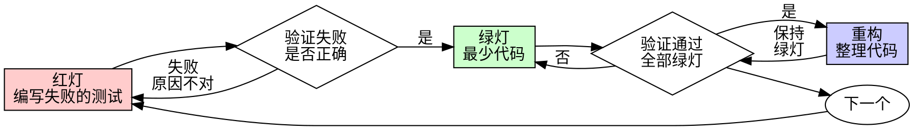

# 测试驱动开发（TDD）

## 概述

先写测试。看它失败。编写最少的代码让它通过。

**核心原则：** 如果你没有看到测试失败，你就不知道它是否测试了正确的东西。

**违反规则的字面意思就是违反规则的精神。**

## 何时使用

**始终使用：**
- 新功能
- Bug 修复
- 重构（refactoring）
- 行为变更

**例外情况（请询问你的协作伙伴）：**
- 一次性原型
- 生成的代码
- 配置文件

想着"就这一次跳过 TDD"？停下来。那是在自我合理化。

## 铁律

```
没有先写失败的测试，就不能写生产代码
```

在测试之前就写了代码？删掉它。重新开始。

**没有例外：**
- 不要保留作为"参考"
- 不要在写测试的时候"改编"它
- 不要看它
- 删除就是删除

从测试出发，重新实现。就这样。

## 红-绿-重构



### 红灯 - 编写失败的测试

编写一个最小的测试，展示预期行为。

<Good>
```typescript
test('retries failed operations 3 times', async () => {
  let attempts = 0;
  const operation = () => {
    attempts++;
    if (attempts < 3) throw new Error('fail');
    return 'success';
  };

  const result = await retryOperation(operation);

  expect(result).toBe('success');
  expect(attempts).toBe(3);
});
```
名称清晰，测试真实行为，只测一件事
</Good>

<Bad>
```typescript
test('retry works', async () => {
  const mock = jest.fn()
    .mockRejectedValueOnce(new Error())
    .mockRejectedValueOnce(new Error())
    .mockResolvedValueOnce('success');
  await retryOperation(mock);
  expect(mock).toHaveBeenCalledTimes(3);
});
```
名称模糊，测试的是 mock 而不是代码
</Bad>

**要求：**
- 只测一个行为
- 名称清晰
- 使用真实代码（除非不得已才用 mock）

### 验证红灯 - 看它失败

**必须执行。绝不跳过。**

```bash
npm test path/to/test.test.ts
```

确认：
- 测试失败（不是报错）
- 失败信息符合预期
- 因为功能缺失而失败（不是因为拼写错误）

**测试通过了？** 你在测试已有的行为。修改测试。

**测试报错了？** 修复错误，重新运行直到它正确地失败。

### 绿灯 - 最少代码

编写最简单的代码让测试通过。

<Good>
```typescript
async function retryOperation<T>(fn: () => Promise<T>): Promise<T> {
  for (let i = 0; i < 3; i++) {
    try {
      return await fn();
    } catch (e) {
      if (i === 2) throw e;
    }
  }
  throw new Error('unreachable');
}
```
刚好够用
</Good>

<Bad>
```typescript
async function retryOperation<T>(
  fn: () => Promise<T>,
  options?: {
    maxRetries?: number;
    backoff?: 'linear' | 'exponential';
    onRetry?: (attempt: number) => void;
  }
): Promise<T> {
  // YAGNI
}
```
过度设计
</Bad>

不要添加功能、重构其他代码，或做超出测试范围的"改进"。

### 验证绿灯 - 看它通过

**必须执行。**

```bash
npm test path/to/test.test.ts
```

确认：
- 测试通过
- 其他测试仍然通过
- 输出干净（没有错误、警告）

**测试失败了？** 修改代码，不要改测试。

**其他测试失败了？** 立即修复。

### 重构 - 整理代码

仅在绿灯之后：
- 消除重复
- 改善命名
- 提取辅助函数

保持测试绿灯。不要添加行为。

### 循环

为下一个功能编写下一个失败的测试。

## 好的测试

| 品质 | 好的 | 差的 |
|------|------|------|
| **最小化** | 只测一件事。名称中有"和"？拆分它。 | `test('validates email and domain and whitespace')` |
| **清晰** | 名称描述行为 | `test('test1')` |
| **体现意图** | 展示期望的 API | 模糊了代码应该做什么 |

## 为什么顺序很重要

**"我会在之后写测试来验证它能工作"**

事后写的测试会立即通过。立即通过什么也证明不了：
- 可能测试的是错误的东西
- 可能测试的是实现细节而不是行为
- 可能遗漏了你忘记的边界情况
- 你从未看到它捕获到 Bug

先写测试迫使你看到测试失败，证明它确实在测试某些东西。

**"我已经手动测试了所有的边界情况"**

手动测试是随机的。你认为你测试了所有情况，但是：
- 没有测试记录
- 代码变更后无法重新运行
- 在压力下容易遗漏情况
- "我试的时候是好的" 不等于 全面测试

自动化测试是系统性的。每次运行方式完全相同。

**"删除 X 小时的工作是浪费"**

沉没成本谬误。时间已经过去了。你现在的选择：
- 删除并用 TDD 重写（再花 X 小时，高置信度）
- 保留并在之后补测试（30 分钟，低置信度，可能有 Bug）

真正的"浪费"是保留你无法信任的代码。没有真正测试的可用代码就是技术债务。

**"TDD 太教条了，务实意味着灵活适应"**

TDD 本身就是务实的：
- 在提交前发现 Bug（比事后调试更快）
- 防止回归（测试立即捕获破坏）
- 记录行为（测试展示如何使用代码）
- 支持重构（放心修改，测试捕获破坏）

"务实"的捷径 = 在生产环境调试 = 更慢。

**"事后测试也能达到同样的目标——重要的是精神而不是仪式"**

不对。事后测试回答的是"这段代码做了什么？"先写测试回答的是"这段代码应该做什么？"

事后测试会受到你的实现的影响。你测试的是你构建的东西，而不是需求要求的东西。你验证的是你记得的边界情况，而不是发现的边界情况。

先写测试在实现之前强制发现边界情况。事后测试验证的是你记住了所有东西（但你没有）。

30 分钟的事后测试 不等于 TDD。你得到了覆盖率，但失去了测试有效的证明。

## 常见的自我合理化

| 借口 | 现实 |
|------|------|
| "太简单了不需要测试" | 简单的代码也会出 Bug。测试只需 30 秒。 |
| "我之后会测试" | 立即通过的测试什么也证明不了。 |
| "事后测试也能达到同样的目标" | 事后测试 = "这做了什么？" 先写测试 = "这应该做什么？" |
| "已经手动测试过了" | 随机 不等于 系统化。没有记录，无法重跑。 |
| "删掉 X 小时的工作是浪费" | 沉没成本谬误。保留未经验证的代码才是技术债务。 |
| "保留作参考，先写测试" | 你会"改编"它。那就是事后测试。删除就是删除。 |
| "需要先探索一下" | 可以。探索完后丢掉探索代码，从 TDD 开始。 |
| "测试难写 = 设计不清楚" | 听测试的声音。难以测试 = 难以使用。 |
| "TDD 会拖慢我" | TDD 比调试快。务实 = 先写测试。 |
| "手动测试更快" | 手动测试无法证明边界情况。每次改动都要重测。 |
| "现有代码没有测试" | 你正在改进它。为现有代码补上测试。 |

## 红色警告 - 停下来重新开始

- 先写了代码再写测试
- 实现之后再补测试
- 测试立即通过
- 无法解释测试为什么失败
- 测试"之后再加"
- 自我合理化"就这一次"
- "我已经手动测试过了"
- "事后测试也能达到同样目的"
- "重要的是精神而不是仪式"
- "保留作参考"或"改编现有代码"
- "已经花了 X 小时了，删掉太浪费"
- "TDD 太教条了，我是在务实"
- "这次情况不一样因为..."

**以上所有情况意味着：删除代码。用 TDD 重新开始。**

## 示例：Bug 修复

**Bug：** 空邮箱被接受了

**红灯**
```typescript
test('rejects empty email', async () => {
  const result = await submitForm({ email: '' });
  expect(result.error).toBe('Email required');
});
```

**验证红灯**
```bash
$ npm test
FAIL: expected 'Email required', got undefined
```

**绿灯**
```typescript
function submitForm(data: FormData) {
  if (!data.email?.trim()) {
    return { error: 'Email required' };
  }
  // ...
}
```

**验证绿灯**
```bash
$ npm test
PASS
```

**重构**
如有需要，为多个字段提取验证逻辑。

## 验证清单

在标记工作完成之前：

- [ ] 每个新函数/方法都有测试
- [ ] 在实现之前看到每个测试失败
- [ ] 每个测试因预期原因失败（功能缺失，不是拼写错误）
- [ ] 为每个测试编写了最少的代码
- [ ] 所有测试通过
- [ ] 输出干净（没有错误、警告）
- [ ] 测试使用真实代码（只在不得已时才用 mock）
- [ ] 覆盖了边界情况和错误情况

无法勾选所有项？你跳过了 TDD。重新开始。

## 遇到困难时

| 问题 | 解决方案 |
|------|----------|
| 不知道怎么测试 | 写出你期望的 API。先写断言。问你的协作伙伴。 |
| 测试太复杂 | 设计太复杂。简化接口。 |
| 什么都需要 mock | 代码耦合太严重。使用依赖注入。 |
| 测试准备工作太多 | 提取辅助函数。还是复杂？简化设计。 |

## 与调试的整合

发现了 Bug？写一个失败的测试来复现它。遵循 TDD 循环。测试证明修复有效并防止回归。

绝不在没有测试的情况下修复 Bug。

## 测试反模式

在添加 mock 或测试工具时，阅读 @testing-anti-patterns.md 以避免常见陷阱：
- 测试 mock 的行为而不是真实行为
- 向生产类添加仅用于测试的方法
- 在不理解依赖关系的情况下使用 mock

## 最终规则

```
生产代码 → 必须有先写的、失败过的测试
否则 → 不是 TDD
```

没有协作伙伴的许可，不允许例外。
