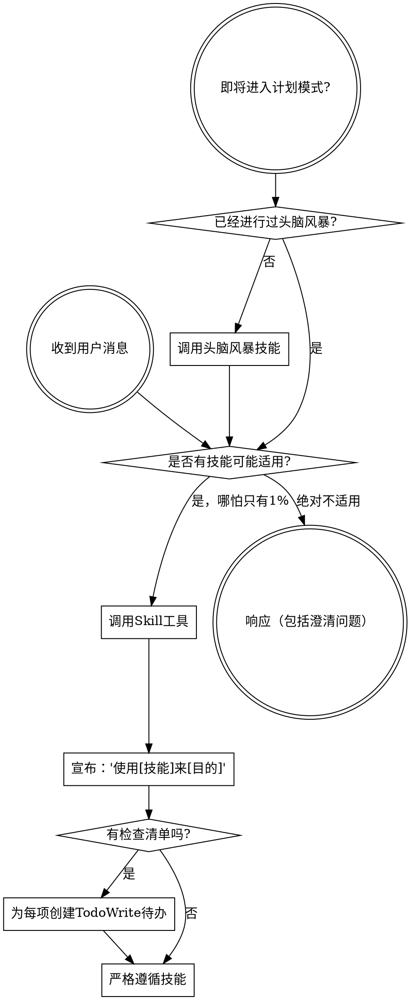

<SUBAGENT-STOP>
如果你是作为子代理（subagent）被派发来执行特定任务的，请跳过此技能。
</SUBAGENT-STOP>

<EXTREMELY-IMPORTANT>
如果你认为哪怕只有 1% 的可能某个技能适用于你正在做的事情，你绝对必须调用该技能。

如果某个技能适用于你的任务，你没有选择权。你必须使用它。

这不可商量。这不是可选的。你不能通过合理化来逃避这一点。
</EXTREMELY-IMPORTANT>

## 指令优先级

Superpowers 技能覆盖默认系统提示行为，但**用户指令始终具有最高优先级**：

1. **用户的明确指令**（CLAUDE.md、GEMINI.md、AGENTS.md、直接请求）—— 最高优先级
2. **Superpowers 技能** —— 在冲突处覆盖默认系统行为
3. **默认系统提示** —— 最低优先级

如果 CLAUDE.md、GEMINI.md 或 AGENTS.md 说"不要使用 TDD"，而某个技能说"始终使用 TDD"，请遵循用户的指令。用户拥有控制权。

## 如何访问技能

**在 Claude Code 中：** 使用 `Skill` 工具。当你调用一个技能时，其内容会被加载并呈现给你——直接遵循它。绝不使用 Read 工具读取技能文件。

**在 Gemini CLI 中：** 技能通过 `activate_skill` 工具激活。Gemini 在会话开始时加载技能元数据，并按需激活完整内容。

**在其他环境中：** 查阅你的平台文档了解技能如何加载。

## 平台适配

技能使用 Claude Code 的工具名称。非 CC 平台：参见 `references/codex-tools.md`（Codex）获取工具等价物。Gemini CLI 用户通过 GEMINI.md 自动获取工具映射。

# 使用技能

## 规则

**在任何响应或操作之前调用相关或被请求的技能。** 哪怕只有 1% 的可能某个技能适用，你也应该调用该技能进行检查。如果调用的技能与当前情况不匹配，你不必使用它。

## 危险信号

这些想法意味着停下来——你在自我合理化：

| 想法 | 现实 |
|------|------|
| "这只是一个简单的问题" | 问题也是任务。检查是否有适用的技能。 |
| "我需要先了解更多上下文" | 技能检查在澄清问题之前。 |
| "让我先探索一下代码库" | 技能会告诉你如何探索。先检查技能。 |
| "我可以快速查一下 git/文件" | 文件缺少对话上下文。检查是否有适用的技能。 |
| "让我先收集信息" | 技能会告诉你如何收集信息。 |
| "这不需要正式的技能" | 如果技能存在，就使用它。 |
| "我记得这个技能" | 技能会更新。阅读当前版本。 |
| "这不算一个任务" | 操作 = 任务。检查是否有适用的技能。 |
| "这个技能太重了" | 简单的事情会变复杂。使用它。 |
| "我先做完这一件事" | 在做任何事之前先检查技能。 |
| "这感觉很有效率" | 无纪律的行动浪费时间。技能可以防止这种情况。 |
| "我知道那是什么意思" | 知道概念 ≠ 使用技能。调用它。 |

## 技能优先级

当多个技能可能适用时，使用以下顺序：

1. **流程类技能优先**（头脑风暴、调试）—— 这些决定如何处理任务
2. **实现类技能其次**（前端设计、MCP 构建器）—— 这些指导执行

"让我们构建 X" → 先头脑风暴，再使用实现类技能。
"修复这个 Bug" → 先调试，再使用领域特定技能。

## 技能类型

**刚性技能**（TDD、调试）：严格遵循。不要以适应性为由放松纪律。

**柔性技能**（模式）：将原则适应于具体上下文。

技能本身会告诉你它属于哪种类型。

## 用户指令

指令说的是做什么，不是怎么做。"添加 X"或"修复 Y"不意味着跳过工作流。
