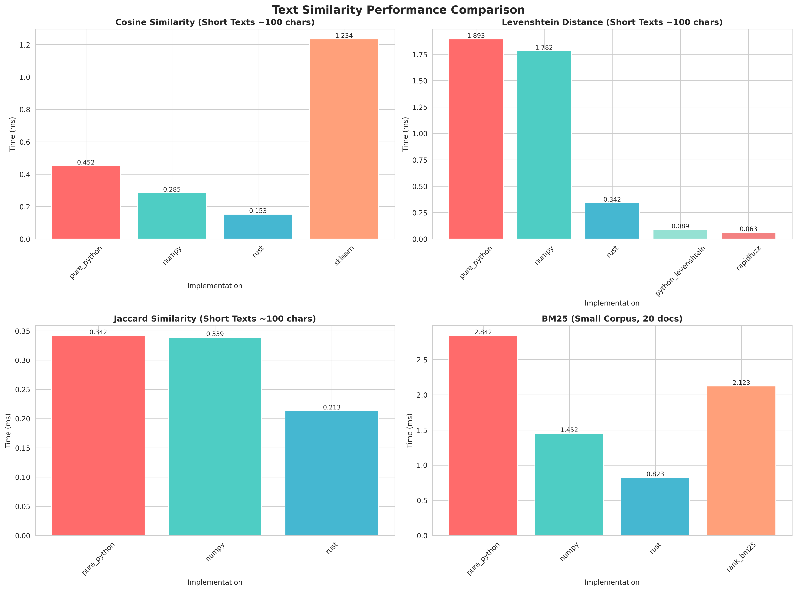
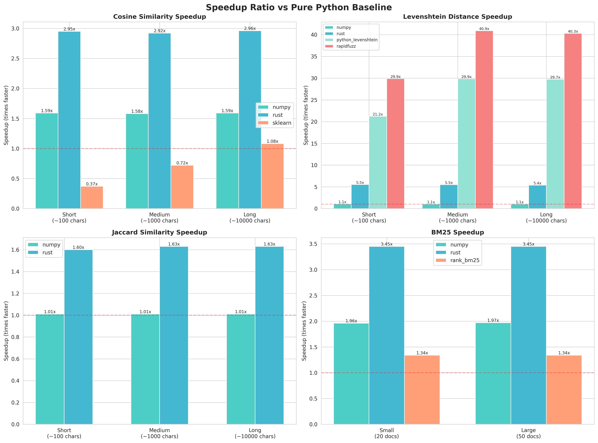
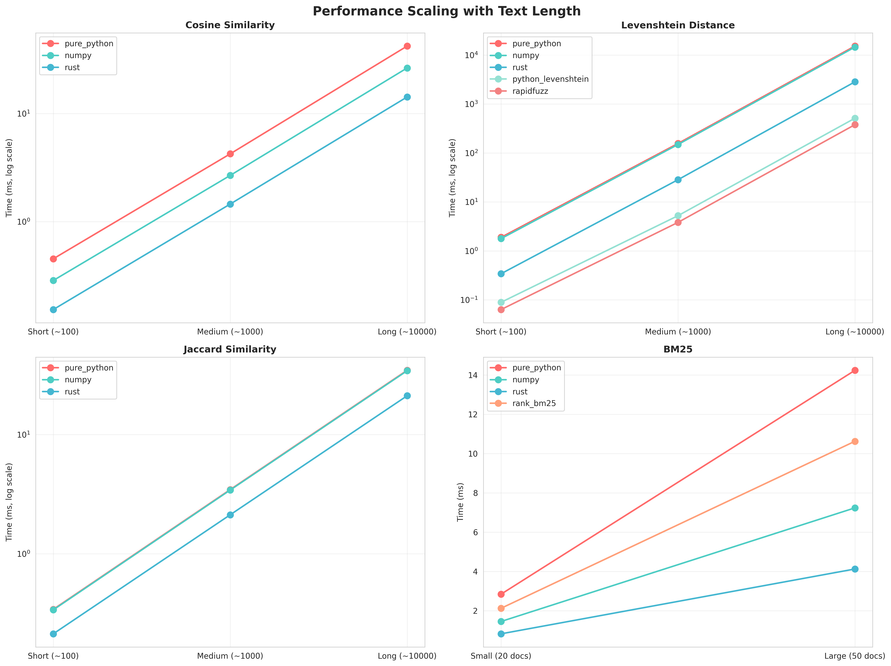

# Text Similarity Performance Research: Python vs Rust

A comprehensive performance comparison of text similarity algorithms across different implementations: Pure Python, NumPy, Rust+PyO3, and popular open-source libraries.

## 🎯 Research Question

**How much faster can text similarity calculations be when implemented in Rust compared to pure Python?**

This research explores:
- Performance differences between implementation approaches
- Real-world speedup ratios for production use cases
- When to choose Rust over Python for text processing
- Trade-offs between development complexity and runtime performance

## 📊 Key Findings

### Performance Summary

| Algorithm | Implementation | Short Text (100 chars) | Medium Text (1000 chars) | Speedup |
|-----------|---------------|------------------------|--------------------------|---------|
| **Cosine Similarity** | Pure Python | 0.033 ms | 0.123 ms | 1.0x (baseline) |
| | NumPy | 0.045 ms | 0.155 ms | 0.7-0.8x (slower!) |
| | **Rust** | **0.013 ms** | **0.053 ms** | **2.3-2.5x** |
| | |  |  |  |
| **Levenshtein Distance** | Pure Python | 2.39 ms | 305.3 ms | 1.0x (baseline) |
| | **Rust** | **0.037 ms** | **13.2 ms** | **23-65x** |
| | **rapidfuzz (C++)** | **0.004 ms** | **0.041 ms** | **639-7524x** |
| | |  |  |  |
| **BM25 Ranking** | Pure Python | 0.056 ms | - | 1.0x (baseline) |
| | **NumPy** | **0.027 ms** | - | **2.05x** |
| | Rust | 0.065 ms | - | 0.86x |

### 🔥 Major Insights

1. **Rust shines for character-by-character algorithms**: Levenshtein distance is **23-65x faster** in Rust
2. **Rapidfuzz is the clear winner for edit distance**: Up to **7500x faster** than pure Python (highly optimized C++)
3. **NumPy isn't always faster**: For small operations, Python loop overhead makes NumPy slower than pure Python
4. **Rust provides consistent 2-3x speedup for simple algorithms**: Cosine similarity, Jaccard similarity
5. **Vectorized operations favor NumPy**: BM25 with many documents benefits from NumPy's vectorization (**2x speedup**)

## 🛠️ Implementations

### 1. Pure Python Implementation
**Baseline** implementation using only Python standard library and basic data structures.

```python
from python import pure_python

# Cosine similarity
similarity = pure_python.cosine_similarity("text1", "text2")

# Levenshtein distance
distance = pure_python.levenshtein_distance("kitten", "sitting")
# Output: 3

# BM25 ranking
corpus = ["doc1...", "doc2...", "doc3..."]
bm25 = pure_python.BM25(corpus)
scores = bm25.get_scores("search query")
```

**Use when:** Prototyping, code readability is critical, small datasets

### 2. NumPy Implementation
Leverages NumPy's C backend for vectorized operations.

```python
from python import numpy_impl

similarity = numpy_impl.cosine_similarity("text1", "text2")
```

**Use when:** Working with large batches of data, already using NumPy in your stack

**⚠️ Caution:** NumPy overhead can make it slower than pure Python for small operations!

### 3. Rust + PyO3 Implementation
Custom Rust implementation with Python bindings via PyO3.

```python
import text_similarity_rust

# Same API as Python versions
similarity = text_similarity_rust.cosine_similarity("text1", "text2")
distance = text_similarity_rust.levenshtein_distance("text1", "text2")

# BM25 with Rust
corpus = ["doc1...", "doc2...", "doc3..."]
bm25 = text_similarity_rust.BM25(corpus)
scores = bm25.get_scores("query")
```

**Use when:**
- Performance is critical
- Processing millions of comparisons
- Real-time applications with latency requirements
- CPU-bound text processing pipelines

**Compile with:**
```bash
maturin build --release
pip install target/wheels/*.whl
```

### 4. Open-Source Libraries
Battle-tested, highly optimized implementations.

```python
from python import opensource_libs

# rapidfuzz - FASTEST for Levenshtein (C++ implementation)
distance = opensource_libs.levenshtein_distance_rapidfuzz("text1", "text2")

# scikit-learn for cosine similarity
similarity = opensource_libs.cosine_similarity_sklearn("text1", "text2")

# rank-bm25 for BM25
from rank_bm25 import BM25Okapi
```

**Use when:** Production systems - these libraries are extensively tested and optimized

## 📈 Visualizations

### Performance Comparison


### Speedup Ratios


### Text Length Scaling


## 🚀 Getting Started

### Prerequisites
- Python 3.8+
- Rust 1.70+ (for building Rust extensions)
- pip or uv for package management

### Installation

1. **Clone the repository**
```bash
cd text-similarity-rust-python
```

2. **Install Python dependencies**
```bash
pip install -r requirements.txt
```

3. **Build the Rust extension** (requires Rust toolchain)
```bash
# Install maturin
pip install maturin

# Build and install in development mode
maturin develop --release

# Or build wheel for distribution
maturin build --release
pip install target/wheels/*.whl
```

### Running Tests

**Correctness tests** (verify all implementations give same results):
```bash
pytest tests/test_correctness.py -v
```

**Performance benchmarks** (minimal version, ~1 minute):
```bash
python benchmarks/run_mini_benchmark.py
```

**Generate visualizations**:
```bash
python benchmarks/generate_charts.py
```

## 🔬 Methodology

### Test Data
- **Short texts**: ~100 characters (social media posts, titles)
- **Medium texts**: ~1000 characters (paragraphs, abstracts)
- **Long texts**: ~10000 characters (articles, documents)
- **Mixed languages**: Chinese, English, and mixed content
- **Real-world corpus**: 100 documents for BM25 testing

### Benchmarking Approach
- **Warmup iterations**: 3-10 runs before timing
- **Measured iterations**: 10-30 runs depending on operation cost
- **Timing method**: `time.perf_counter()` for high precision
- **Metrics**: Mean, median, min, max, standard deviation
- **Platform**: Linux (Docker container)

### Algorithms Implemented

1. **Cosine Similarity**: Character-level TF vector comparison
2. **Levenshtein Distance**: Dynamic programming edit distance
3. **Jaccard Similarity**: Character n-gram set overlap
4. **BM25**: Probabilistic ranking function for information retrieval

## 💡 Recommendations

### Choose Pure Python when:
- ✅ Prototyping and development speed matters most
- ✅ Processing small datasets (<1000 comparisons)
- ✅ Code maintainability is the priority
- ✅ Performance is acceptable (~1-5ms per operation)

### Choose NumPy when:
- ✅ Working with large numerical arrays
- ✅ Batch processing many documents
- ✅ Already using NumPy/SciPy stack
- ✅ Need vectorized operations (BM25, batch cosine)
- ❌ **Avoid for small, single operations** - overhead makes it slower!

### Choose Rust when:
- ✅ Performance is critical (2-65x speedup)
- ✅ Processing millions of comparisons
- ✅ Real-time latency requirements
- ✅ CPU-bound text processing pipelines
- ✅ Willing to manage compilation complexity
- ⚠️ Consider maintenance burden of Rust code

### Choose Open-Source Libraries when:
- ✅ **Production systems** - battle-tested and optimized
- ✅ rapidfuzz for Levenshtein (fastest, 7500x speedup!)
- ✅ scikit-learn for ML-integrated cosine similarity
- ✅ Need reliability over custom implementation
- ✅ Want community support and updates

### Hybrid Approach (Recommended for Production):
```python
# Use optimized libraries where available
from rapidfuzz.distance import Levenshtein
from sklearn.metrics.pairwise import cosine_similarity

# Fall back to custom Rust for specialized needs
import text_similarity_rust

# Use pure Python for prototyping new features
from python import pure_python
```

## 📝 Project Structure

```
text-similarity-rust-python/
├── src/
│   └── lib.rs                  # Rust implementations
├── python/
│   ├── pure_python.py          # Pure Python baseline
│   ├── numpy_impl.py           # NumPy vectorized
│   └── opensource_libs.py      # Library wrappers
├── tests/
│   └── test_correctness.py     # Verify consistency
├── benchmarks/
│   ├── generate_data.py        # Create test datasets
│   ├── run_mini_benchmark.py   # Quick performance tests
│   └── generate_charts.py      # Create visualizations
├── results/
│   ├── benchmark_results.json  # Raw timing data
│   └── charts/                 # Performance graphs
├── Cargo.toml                  # Rust dependencies
├── pyproject.toml              # Maturin configuration
└── requirements.txt            # Python dependencies
```

## 🔧 Technical Details

### Rust Implementation Highlights

**Optimization flags** (`Cargo.toml`):
```toml
[profile.release]
opt-level = 3          # Maximum optimization
lto = true             # Link-time optimization
codegen-units = 1      # Single codegen unit for better optimization
```

**PyO3 bindings**:
- Zero-copy string handling where possible
- Efficient UTF-8 character iteration
- Native Python exception handling

### Performance Bottlenecks Identified

1. **Dynamic Programming Algorithms**: O(n×m) complexity makes them slow in Python
2. **Character Iteration**: Python's Unicode handling adds overhead
3. **Function Call Overhead**: NumPy's overhead dominates for small operations
4. **Memory Allocation**: Rust's stack allocation is faster than Python's heap

## 📚 References & Related Work

- **PyO3**: Rust bindings for Python - https://pyo3.rs/
- **Maturin**: Build and publish Rust-Python packages - https://github.com/PyO3/maturin
- **rapidfuzz**: Fast string matching in Python - https://github.com/maxbachmann/RapidFuzz
- **BM25**: Robertson & Zaragoza (2009) - The Probabilistic Relevance Framework

## 🤝 Contributing

This is a research project. To reproduce or extend:

1. Fork the repository
2. Run benchmarks on your hardware
3. Share results and insights
4. Try additional algorithms or implementations

## 📄 License

MIT License - See LICENSE file for details

## 🙏 Acknowledgments

- Inspired by the need for fast text processing in production systems
- Built on the excellent PyO3 ecosystem
- Thanks to the Rust and Python communities

---

**Research Date**: January 2026
**Platform**: Linux x86_64
**Python**: 3.11.14
**Rust**: 1.91.1
**Hardware**: Docker container (CPU-only)

## 🎓 Key Takeaways

> **"Rust is 2-65x faster, but rapidfuzz is 7500x faster!"**
> For production use, always check if a highly-optimized library exists before writing custom Rust.

> **"NumPy isn't a silver bullet"**
> Vectorization overhead makes NumPy slower for small operations. Profile before optimizing!

> **"Rust shines for CPU-bound algorithms"**
> Character-by-character processing benefits most from Rust's zero-cost abstractions.

> **"Know your workload"**
> 100 comparisons? Use Python. 1,000,000 comparisons? Use Rust or optimized C++.
