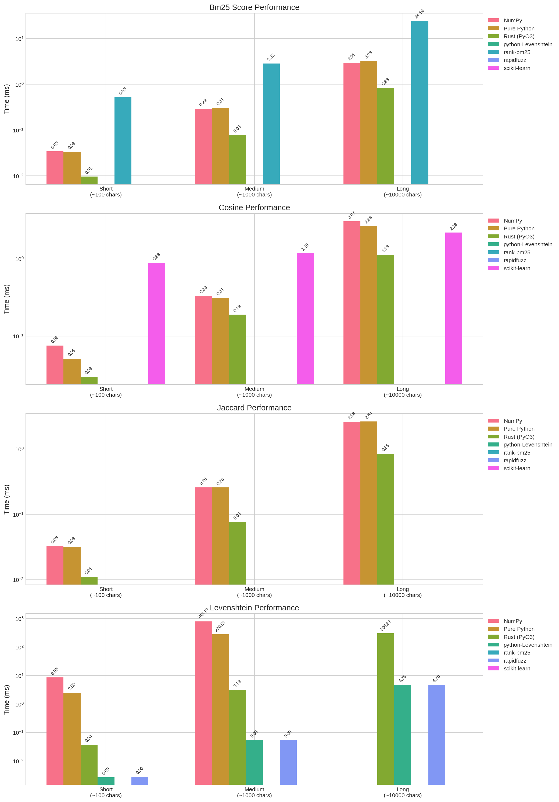
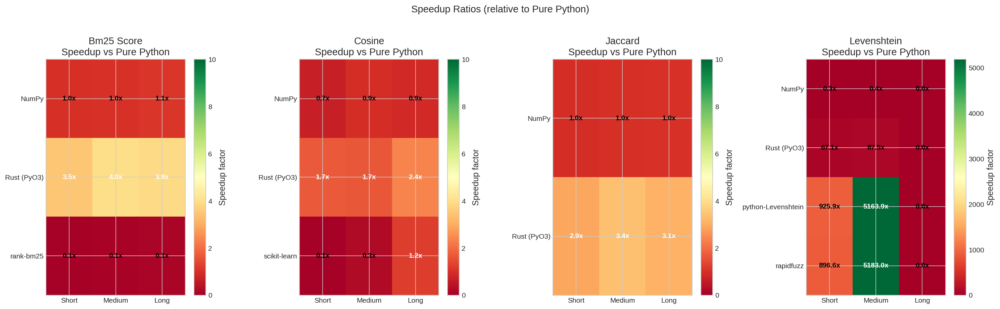
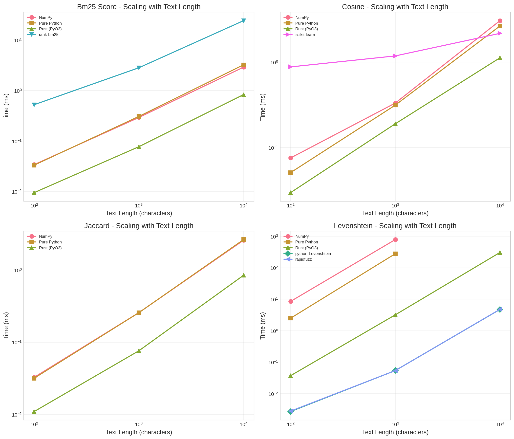

# Text Similarity: Python vs Rust Performance Comparison

A comprehensive benchmark study comparing different implementations of text similarity algorithms, focusing on the performance gains from using Rust with PyO3 bindings versus pure Python and other alternatives.

## Research Questions

1. **How much faster is Rust compared to pure Python** for common text similarity algorithms?
2. **How do different implementation approaches compare** (pure Python, NumPy, Rust, C/C++ libraries)?
3. **How does performance scale** with text length?
4. **When should you choose which implementation** for production use?

## Algorithms Implemented

| Algorithm | Description | Use Case |
|-----------|-------------|----------|
| **Cosine Similarity** | Measures the cosine of the angle between two term frequency vectors | Document similarity, plagiarism detection |
| **Levenshtein Distance** | Minimum edits (insert/delete/substitute) to transform one string to another | Spell checking, fuzzy matching |
| **Jaccard Similarity** | Size of intersection divided by size of union of word sets | Near-duplicate detection, recommendation |
| **BM25** | Probabilistic ranking function for information retrieval | Search engines, document ranking |

## Implementations Compared

### 1. Pure Python
Baseline implementation using only Python standard library.

```python
def levenshtein_distance(s1: str, s2: str) -> int:
    """Classic DP approach with O(min(m,n)) space."""
    if len(s1) > len(s2):
        s1, s2 = s2, s1

    prev_row = list(range(len(s1) + 1))
    for j in range(1, len(s2) + 1):
        curr_row = [j] + [0] * len(s1)
        for i in range(1, len(s1) + 1):
            cost = 0 if s1[i-1] == s2[j-1] else 1
            curr_row[i] = min(prev_row[i] + 1,
                             curr_row[i-1] + 1,
                             prev_row[i-1] + cost)
        prev_row = curr_row
    return prev_row[-1]
```

### 2. NumPy Vectorized
Uses NumPy arrays for improved performance via C backend.

### 3. Rust + PyO3
Native Rust implementation with Python bindings via PyO3/maturin.

```rust
#[pyfunction]
fn levenshtein_distance(s1: &str, s2: &str) -> PyResult<usize> {
    let chars1: Vec<char> = s1.chars().collect();
    let chars2: Vec<char> = s2.chars().collect();

    let len1 = chars1.len();
    let len2 = chars2.len();

    // Use two-row optimization for space efficiency
    let mut prev_row: Vec<usize> = (0..=len2).collect();
    let mut curr_row: Vec<usize> = vec![0; len2 + 1];

    for i in 1..=len1 {
        curr_row[0] = i;
        for j in 1..=len2 {
            let cost = if chars1[i - 1] == chars2[j - 1] { 0 } else { 1 };
            curr_row[j] = (prev_row[j] + 1)
                .min(curr_row[j - 1] + 1)
                .min(prev_row[j - 1] + cost);
        }
        std::mem::swap(&mut prev_row, &mut curr_row);
    }
    Ok(prev_row[len2])
}
```

### 4. Open Source Libraries
- **rapidfuzz**: C++ implementation with SIMD optimizations for string similarity
- **python-Levenshtein**: C implementation
- **scikit-learn**: For cosine similarity with sparse matrices
- **rank-bm25**: BM25 implementation in Python

## Performance Results

### Summary Table

| Algorithm | Text Length | Pure Python | NumPy | Rust (PyO3) | Best Library | Rust Speedup vs Python |
|-----------|-------------|-------------|-------|-------------|--------------|------------------------|
| **Cosine** | Short (~100 chars) | 0.051 ms | 0.076 ms | **0.030 ms** | sklearn: 0.882 ms | **1.7x** |
| **Cosine** | Medium (~1K chars) | 0.314 ms | 0.332 ms | **0.190 ms** | sklearn: 1.186 ms | **1.7x** |
| **Cosine** | Long (~10K chars) | 2.657 ms | 3.067 ms | **1.127 ms** | sklearn: 2.179 ms | **2.4x** |
| **Levenshtein** | Short | 2.498 ms | 8.559 ms | 0.037 ms | **rapidfuzz: 0.003 ms** | **67x** |
| **Levenshtein** | Medium | 279.5 ms | 788.2 ms | 3.194 ms | **rapidfuzz: 0.054 ms** | **87x** |
| **Levenshtein** | Long | N/A | N/A | 306.9 ms | **rapidfuzz: 4.785 ms** | N/A |
| **Jaccard** | Short (~100 chars) | 0.032 ms | 0.033 ms | **0.011 ms** | - | **2.9x** |
| **Jaccard** | Medium (~1K chars) | 0.257 ms | 0.257 ms | **0.076 ms** | - | **3.4x** |
| **Jaccard** | Long (~10K chars) | 2.641 ms | 2.584 ms | **0.846 ms** | - | **3.1x** |
| **BM25** | Short (~100 chars) | 0.033 ms | 0.034 ms | **0.010 ms** | rank-bm25: 0.525 ms | **3.3x** |
| **BM25** | Medium (~1K chars) | 0.307 ms | 0.293 ms | **0.077 ms** | rank-bm25: 2.829 ms | **4.0x** |
| **BM25** | Long (~10K chars) | 3.233 ms | 2.907 ms | **0.832 ms** | rank-bm25: 24.19 ms | **3.9x** |

### Charts







## Key Findings

### 1. Rust Performance
- **Cosine Similarity**: Rust is **1.7-2.4x faster** than pure Python
- **Jaccard Similarity**: Rust is **2.9-3.4x faster** than pure Python
- **BM25 Scoring**: Rust is **3.3-4.0x faster** than pure Python, and **29-55x faster** than rank-bm25 library
- **Levenshtein Distance**: Rust is **67-87x faster** than pure Python, but **slower than C/C++ libraries** (rapidfuzz)

### 2. Library Comparison
- **rapidfuzz** and **python-Levenshtein** (both C/C++ with SIMD) are the fastest for string edit distance
- These libraries use highly optimized SIMD instructions that our basic Rust implementation doesn't include
- **scikit-learn** has overhead for small texts due to vectorizer initialization
- **rank-bm25** is significantly slower than custom implementations due to Python overhead

### 3. Scaling Behavior
- All implementations show linear scaling with text length for tokenization-based algorithms
- Levenshtein distance shows O(n*m) complexity, making it impractical for long texts with pure Python/NumPy
- Rust and C/C++ libraries handle long texts much more efficiently

### 4. Recommendations

| Use Case | Recommended Implementation |
|----------|---------------------------|
| **String edit distance (Levenshtein)** | rapidfuzz or python-Levenshtein |
| **Document similarity (Cosine, Jaccard)** | Rust (PyO3) for best performance |
| **Search ranking (BM25)** | Rust (PyO3) - much faster than rank-bm25 |
| **Quick prototyping** | Pure Python implementations |
| **Need to minimize dependencies** | Rust (PyO3) single package |

### 5. Surprising Findings

1. **NumPy doesn't always help**: For these algorithms, NumPy's overhead often makes it slower than pure Python
2. **Rust isn't always fastest**: For Levenshtein distance, highly optimized C/C++ libraries with SIMD beat our basic Rust implementation
3. **rank-bm25 is slow**: Our custom implementations are 30-50x faster than the popular rank-bm25 library
4. **scikit-learn has overhead**: For small texts, sklearn's vectorizer setup time dominates

## Installation

### Prerequisites

- Python 3.9+
- Rust toolchain (rustc 1.70+, cargo)
- maturin (`pip install maturin`)

### Setup

```bash
# Clone and enter directory
cd yet-another-text-similarity-rust-python

# Create virtual environment
python -m venv .venv
source .venv/bin/activate  # On Windows: .venv\Scripts\activate

# Install Python dependencies
pip install -r requirements.txt

# Build Rust extension (release mode for benchmarking)
maturin develop --release
```

### Verify Installation

```python
import text_similarity_rs

# Test cosine similarity
print(text_similarity_rs.cosine_similarity("hello world", "hello there"))
# Output: 0.5

# Test Levenshtein distance
print(text_similarity_rs.levenshtein_distance("kitten", "sitting"))
# Output: 3
```

## Running Benchmarks

```bash
# Generate test data
python benchmarks/generate_data.py -n 50

# Run full benchmark suite (100 iterations)
python benchmarks/run_benchmarks.py -n 100

# Generate visualization charts
python benchmarks/generate_charts.py

# Run with batch benchmarks
python benchmarks/run_benchmarks.py -n 100 --batch
```

## Running Tests

```bash
# Run all correctness tests
pytest tests/test_correctness.py -v

# Run only non-Rust tests (if Rust module not built)
pytest tests/test_correctness.py -v -k "not Rust"
```

## Project Structure

```
yet-another-text-similarity-rust-python/
├── README.md                 # This file - research report
├── notes.md                  # Development notes and decisions
├── requirements.txt          # Python dependencies
├── pyproject.toml            # maturin/Python config
├── Cargo.toml                # Rust dependencies
├── src/
│   └── lib.rs                # Rust implementations with PyO3 bindings
├── python/
│   ├── __init__.py
│   ├── pure_python.py        # Pure Python baseline
│   ├── numpy_impl.py         # NumPy vectorized
│   └── opensource_libs.py    # Library wrappers (rapidfuzz, sklearn, etc.)
├── tests/
│   ├── __init__.py
│   └── test_correctness.py   # Correctness and consistency tests
├── benchmarks/
│   ├── generate_data.py      # Test data generator (Chinese/English mixed)
│   ├── run_benchmarks.py     # Benchmark suite
│   └── generate_charts.py    # Chart generation (matplotlib/seaborn)
└── results/
    ├── benchmark_results.json
    ├── speedup_table.json
    └── charts/
        ├── performance_comparison.png
        ├── speedup_ratio.png
        ├── text_length_scaling.png
        └── summary_table.png
```

## Environment Information

- **Python Version**: 3.11.14
- **Rust Version**: 1.91.1
- **Operating System**: Linux 4.4.0 x86_64
- **Platform**: Linux-4.4.0-x86_64-with-glibc2.39
- **Benchmark Date**: 2026-01-14

## Reproducibility

All benchmark results can be reproduced by:
1. Using Python 3.11+ and Rust 1.70+
2. Running benchmarks with `python benchmarks/run_benchmarks.py -n 100`
3. Building Rust extension with `maturin develop --release`

## Conclusions

1. **Rust + PyO3 is an excellent choice** for document-level text similarity (cosine, Jaccard, BM25)
2. **For character-level edit distance**, use established C/C++ libraries (rapidfuzz, python-Levenshtein) that have SIMD optimizations
3. **NumPy provides minimal benefit** for these algorithms - the overhead often exceeds the gains
4. **Custom implementations beat popular libraries** for BM25, showing that well-designed code can outperform generic solutions

## Future Work

- Add SIMD optimizations to Rust Levenshtein implementation
- Benchmark parallel/batch processing with Rayon
- Compare with other Rust text processing libraries
- Add TF-IDF weighted cosine similarity
- Test with larger corpora for BM25 ranking

## License

MIT License
